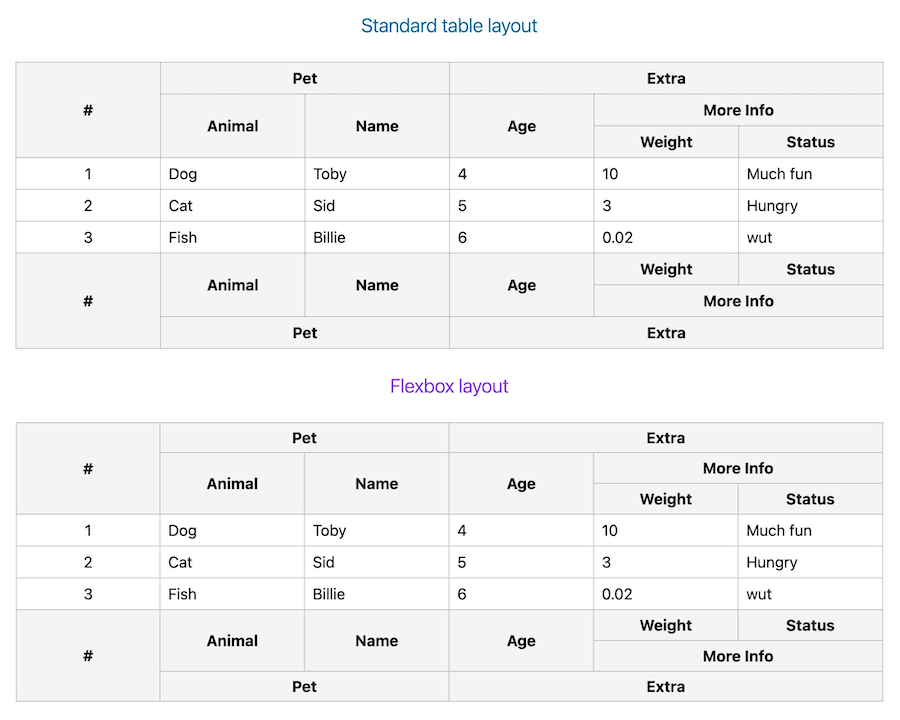

### What

Rowspan thing for headless React Table from Tanstack. See the discussion https://github.com/TanStack/table/discussions/5051.

Works for both header and footer:


### How

Just call it when you render your header (or footer) `<th>` elements, pass the `header` object there and get attributes
to apply on your `<th>` element.

It handles nested groups and columns automatically.

### Usage with standard "display: table" approach for header

```tsx
<table>
  <thead>
  {table.getHeaderGroups().map((headerGroup) => (
    <tr key={headerGroup.id}>
      {headerGroup.headers.map((header) => {
        // notice the function name we pick here
        const rowSpan = tableHeaderRowSpan(header);
        if (!rowSpan) {
          // it's necessary to skip redundant cells
          return null;
        }
        return (
          <th
            className={clsx('border border-black/20 bg-gray-100 px-2')}
            colSpan={header.colSpan}
            rowSpan={rowSpan}
            style={{
              width: header.getSize(),
            }}
          >
            {flexRender(header.column.columnDef.header, header.getContext())}
          </th>);
      })}
    </tr>
  ))}
  </thead>
  <!-- ... -->
```

### Usage with standard "display: table" approach for footer

```tsx
<table>
  <!-- ... -->
  <tfoot>
  {table.getFooterGroups().map((footerGroup) => (
    <tr key={footerGroup.id}>
      {footerGroup.headers.map((header) => {
        // notice the function name we pick here
        const rowSpan = tableFooterRowSpan(header);
        if (!rowSpan) {
          // it's also necessary to skip redundant cells
          return null;
        }
        return (
          <th
            colSpan={header.colSpan}
            rowSpan={rowSpan}
            className={'border border-black/20 bg-gray-100'}
          >
            {flexRender(header.column.columnDef.header, header.getContext())}
          </th>
        );
      })}
    </tr>
  ))}
  </tfoot>
```

### Usage with "display: flex" (or block or grid, whatever non-table) approach for header

```tsx
<table>
  <thead>
  {table.getHeaderGroups().map((headerGroup) => (
    <tr key={headerGroup.id} className={'group/row flex'}>
      {headerGroup.headers.map((header) => {
        const rowSpan = flexTableHeaderRowSpan(header);
        return (
          <th
            className={clsx(
              'group-first/row:border-t border-b border-e first:border-s border-black/20 bg-gray-100 px-2',
              'flex items-center justify-center',
              rowSpan.topBorderMightBeNeeded && 'border-t',
            )}
            style={{
              ...rowSpan.styles('2rem'), // you have to put the height of single header row here
              width: header.getSize(),
            }}
          >
            {flexRender(header.column.columnDef.header, header.getContext())}
          </th>
        );
      })}
    </tr>
  ))}
  </thead>
<!-- ... -->
```

### Usage with "display: flex" (or block or grid, whatever non-table) approach for footer

```tsx
<table>
  <!-- ... -->
  <tfoot>
  {table.getFooterGroups().map((footerGroup) => (
    <tr key={footerGroup.id} className={'group/row flex'}>
      {footerGroup.headers.map((header) => {
        // notice the function name we pick here
        const rowSpan = flexTableFooterRowSpan(header);
        return (
          <th
            data-test-rowspan={header.column.columnDef.meta?.testRowSpan}
            className={clsx(
              'border-t group-last/row:border-b border-e first:border-s border-black/20 bg-gray-100',
              'flex items-center justify-center',
              rowSpan.bottomBorderMightBeNeeded && 'border-b',
            )}
            style={{
              ...rowSpan.styles('2rem'),
              width: header.getSize(),
            }}
          >
            {flexRender(header.column.columnDef.header, header.getContext())}
          </th>
        );
      })}
    </tr>
  ))}
  </tfoot>
```
